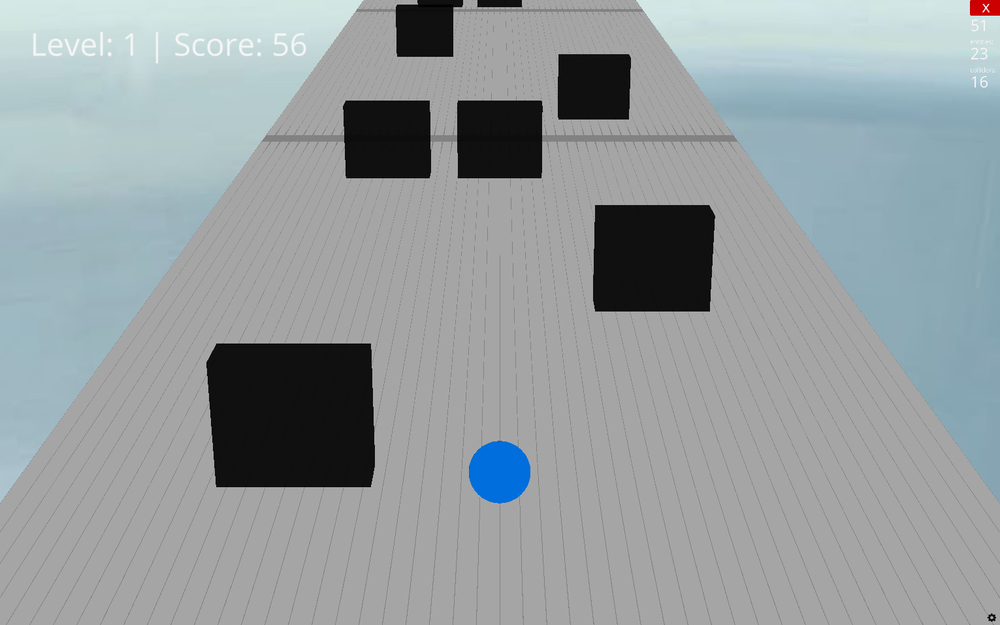
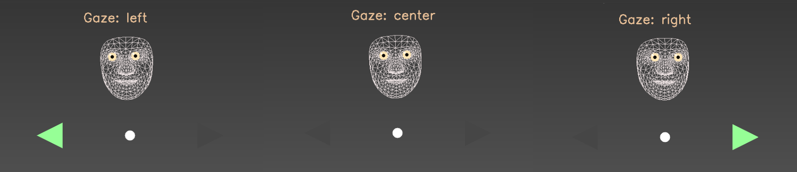

# EyeBall - A Game For Lazy Days :video_game:
:eyes: Lay back and watch the ball roll where you want it to go. \
:robot: Compete with an RL agent.

<p align="center">
  
  <br>
  <em>Avoid obstacles by jumping or swaping lanes</em>
</p>

## Setup

### Prerequisite for eye tracking
If you are on Windows you need [Microsoft Visual C++ Redistributable 2015-2022](https://aka.ms/vs/17/release/vc_redist.x64.exe) to run mediapipe, else you get DLL load errors.\
Check your architecture with:
```bash
python -c "import platform; print(platform.architecture())"
```

### Get started
1. create environment with `conda env create -f environment.yaml`
2. activate it with `conda activate eye`
3. run the game with `python src/app.py`.

## How to play
Avoid obstacles by swaping lanes or jumping over them.

- restart with `r` if you hit an obstacle
- restart with `shift + r` if you want to restart the game during gameplay
- toggle eye tracker ON/OFF with `e`

## Control
1. Keyboard controls:
- Left: `a`
- Right: `d`
- Jump: `space`

2. Eye tracking controls
<p align="center">
  
  <br>
  <em>Eye tracking to control the game with your gaze. Look left = move left, look right = move right </em>
</p>

- Jump: `space`


## Planned Todos (in no particular order)
<details>
<summary>Click to expand</summary>

- [x] Implement eye tracking to control game
- [ ] Improve level generation/more difficulty/more obstacle types etc...
- [ ] Add RL agent --> train to play the game
- [ ] Add ability compete with the RL agent (in the same game)

</details>
